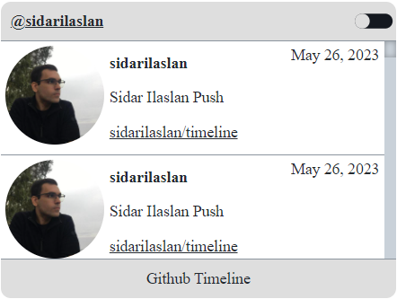
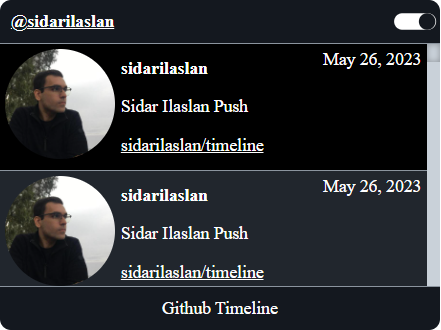
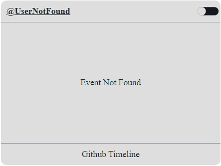

# Github Timeline

a standalone component built using github api

## Screenshots


| Default | Dark Theme On | User Not Found |
| -------------- | -------------- | -------------- |
|  |  |  |

## Data attributes

| Attribute | Values | Default Value |
| -------------- | -------------- | -------------- |
| data-user | string github usernames | |
| data-width |values that can be given for width (px, %, em, auto, initial, inherit etc.) | 400px |
| data-height |values that can be given for height (px, %, em, auto, initial, inherit etc.) | 220px |


## Usage

Add the external script in your body

```bash
  <script src="https://cdn.jsdelivr.net/gh/sidarilaslan/timeline@main/js/timeline.js"></script>
```

Paste the div in your HTML code and change the data-user value

```bash
 <div id="timeline" data-user="sidarilaslan"></div>
```


Optional width and length usage

```bash
   <div id="timeline" data-user="sidarilaslan" data-width="400px" data-height="400px"></div>
```
